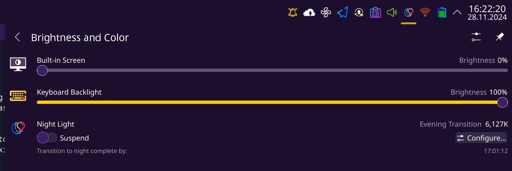

# viauled

This program connects to the Framework RGB keyboard running the default VIA firmware and exposes its backlight brightness as an LED via sysfs

The name of the LED is `viauled::kbd_backlight` is chosen to conform with how other drivers would name a keyboard backlight, making it work seamlessly in services like upower

Below is an example of how it appears on my Framework running KDE (the "Keyboard Backlight" slider)



## Build

Make sure you have `hidapi`, `cmake` and your kernel headers installed

`./build.sh`

## Installing

You can copy the `viauled` binary from the `build` folder to its final destination.

## Running

The process takes two arguments, the USB VID and PID.

[viauled.service](viauled.service) in this repo is an example systemd service file

Otherwise, the binary can just be run as root (so it can connect to the kernel's uled subsystem, alternatively you can maybe use udev to grant additional access to the uled subsystem). Usage as follows:
```
Usage (search by VID/PID): ./build/viauled -v VID -p PID [-l LED_DEVICE]
Usage (specify HID device): ./build/viauled -h HID_DEVICE [-l LED_DEVICE]
```

## Special Thanks

Framework for their nice documentation of the "VIA" protocol in this tool [qmk_hid](https://github.com/FrameworkComputer/qmk_hid)
